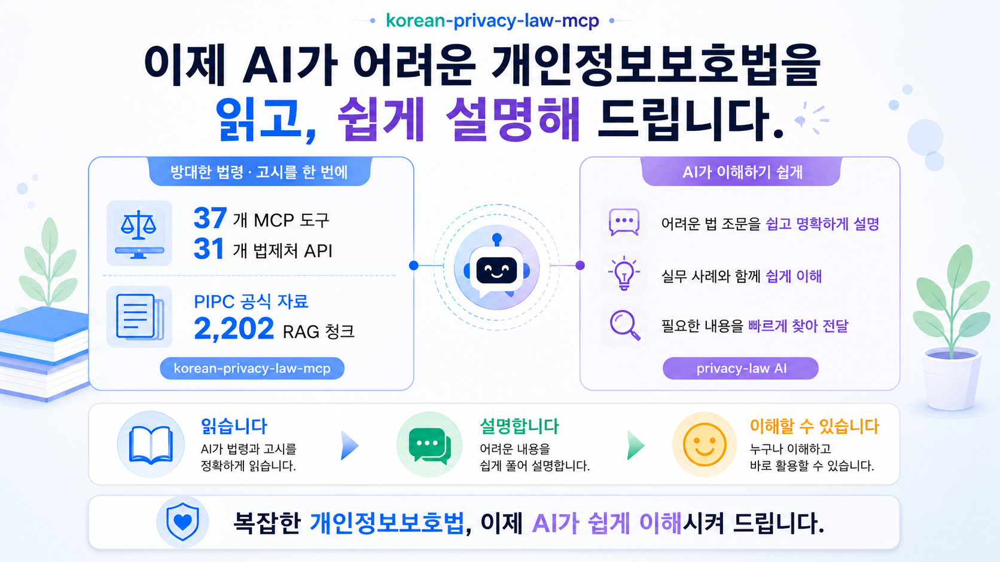
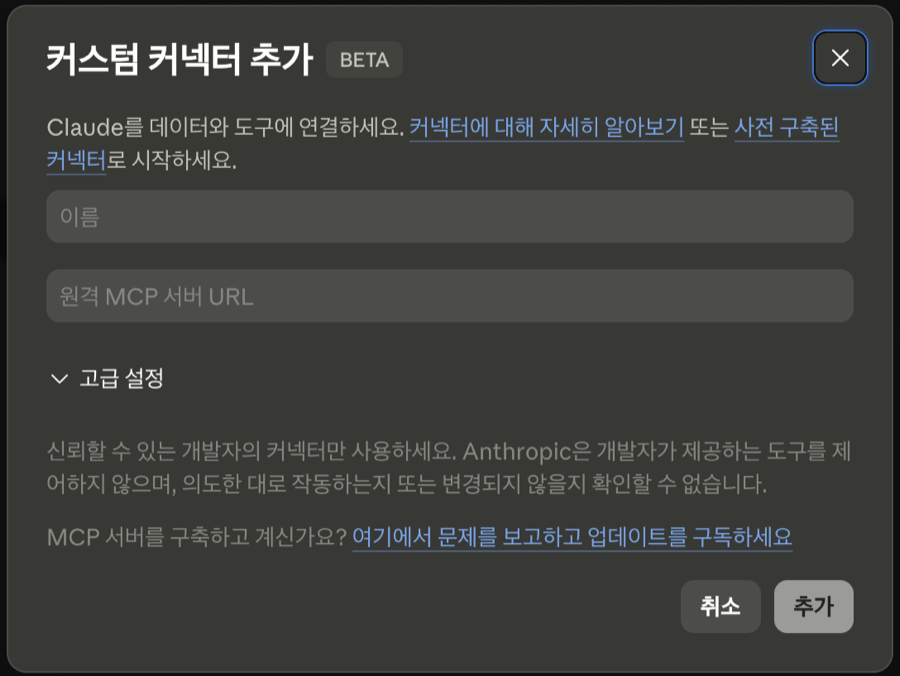

# Korean Privacy Law MCP

[](https://www.npmjs.com/package/korean-privacy-law-mcp)
[](https://modelcontextprotocol.io)
[](./LICENSE)
[](#-도구-구조-37개)
[](#layer-c--rag-코퍼스-3개)

---

대한민국 **개인정보보호법(PIPA)** 을 자연어로 검색·비교·분석·검증하는 MCP 입니다.

법제처 31개 + PIPC 공식 출처 인덱스 2개 + RAG 코퍼스 3개 + 환각 검증 1개 — 총 **37개 MCP 도구** 가 PIPA·시행령·PIPC 고시·의결례 + PIPC 공식 가이드 4종·상담사례 1,745건 (총 2,432 청크) 을 한 번에 다루면서 개인정보보호법과 관련된 문제해결을 도와줍니다.

개인정보보호법, 이제 AI 와 함께 대화하며 풀어 나가봅시다.

[English](./README-EN.md)



---

## 만든 이유

대기업·공공기관에는 내부 법무팀이나 CPO 같은 전문 인력이 있어 개인정보보호에 신경을 쓰고 있습니다.

그러나 중소기업·소상공인·약국 같은 곳은 법이라는 보이지 않는 장벽을 넘기 위한 인력·예산이 부족해 사각지대에 놓여 있습니다.

본 MCP 가 개인정보보호법에 대한 접근이 어려운 분들께 조금이나마 도움이 되었으면 좋겠습니다.

---

## v0.8.0 — 개인정보보호법과 관련법령 그리고 가이드와 상담사례를 한 번에

법제처 OPEN API 31개 wrapper 위에 **PIPC 공식 출처 인덱스 2개 + 가이드·상담사례 RAG 3개 + 4계층 환각 검증 1개** — 총 37개 도구가 한국 법령 정보 + PIPC 공식 자료를 자연어로 검색·비교·분석.

### 주요 개발 사항

- **법제처 OpenAPI 활용 도구 37개 개발**
  - 개인정보보호법 및 관련법령 검색·본문·구조, 개인정보보호위원회 결정문 등 조회, 의료법 등 특별법 조회 등
- **개인정보 포털 가이드 및 상담사례 RAG 실무 데이터 강화**
  - 법제처 API 가 못 가진 실무 자료. 4종 가이드 687청크 (질의응답 99 + 소상공인 41 + CCTV 71 + 분야별 안내서 476 — 8개 편 전체) + 개인정보 포털 상담사례 1,745건.

### 예시 — 자연어 한 줄로 도메인 깊이까지

```
"의료기관에서 환자 개인정보 처리할 때 어떤 법이 우선이야?"
```

결과 예시:

> "「개인정보 보호법」은 일반법(general law), 의료법은 환자 개인정보에 관한 한 특별법(lex specialis) 입니다. PIPC 도 「분야별 개인정보 보호 안내서(2024.12)」 의료기관 편 FAQ 에서 이를 명시했습니다 — 「의료법」에 규정이 있으면 「의료법」이, 없으면 「개인정보 보호법」이 적용됩니다."

```
"개인정보 보호법 §28-2 가명정보 처리 조항이 2020년 6월 시점에 유효했어?"
```

결과 예시:

> 결론: 아니요. 2020년 6월 시점에는 아직 시행 전이었습니다. 이른바 "데이터 3법"(개인정보 보호법·정보통신망법·신용정보법) 개정의 일부로, 2020년 2월 4일 공포 후 6개월의 경과기간을 두고 8월 5일에 발효됐기 때문입니다. 따라서 2020년 6월에 가명정보를 처리하면서 §28조의2를 근거로 삼는 것은 가능하지 않았고, 그 시점에는 가명정보 개념을 직접 규율하는 일반법 조문 자체가 부재했습니다(통계작성·과학적 연구·공익적 기록보존 목적의 가명처리·결합 등 새로운 적법처리 근거는 모두 8.5 이후 개시).

**자연어 한 줄로 PIPA 도메인 추적 + 인용 검증을 한 번에**.

---

## 설치 및 사용법

### 사전 준비 1: API 키 발급 (무료, 1분)

모든 방법에 공통으로 필요한 **법제처 OPEN API 인증키(OC)** 를 먼저 발급받으세요.

1. [법제처 OPEN API 신청 페이지](https://open.law.go.kr/LSO/openApi/guideResult.do) 접속
2. 회원가입 후 로그인
3. "OPEN API 사용 신청" 버튼 클릭
4. 신청서 작성 → **인증키(OC)** 발급 (이메일 ID 형식)

> 아래 모든 예시의 `your-api-key-here` 는 본인 발급 키로 교체하세요.

### 사전 준비 2: Node.js 설치 (권장)

- **로컬 MCP 서버 사용 시** (방법 1·3) — Node.js 설치 필요 (**Node.js 20 이상**)
  → 설치는 귀찮지만 안정적 답변 + 속도 빠름
- **원격 MCP 서버 사용 시** (방법 2 — Claude.ai 웹) — Node.js 불필요
  → 하지만 속도가 느릴 수 있음

**macOS:**
```bash
# 옵션 A — Homebrew (권장)
brew install node

# 옵션 B — 공식 인스톨러
# https://nodejs.org/ko/download → LTS 버전 다운로드
```

**Windows:**

```powershell
# https://nodejs.org/ko/download 에서 LTS 버전 다운로드
```

**Linux (Ubuntu / Debian):**
```bash
curl -fsSL https://deb.nodesource.com/setup_20.x | sudo bash -
sudo apt install -y nodejs
```

**확인:**
```bash
node --version    # v20.x.x 이상이 떠야 함
npx --version
```

<a id="method-1"></a>

### ⭐ 방법 1: Claude Desktop 자동 설치 (npx, 안정적, 권장)

> [!IMPORTANT]
> Claude Desktop 설정 파일에 아래 한 블록만 추가하면 끝.
>
> **설정 파일 위치**:
> - macOS: `~/Library/Application Support/Claude/claude_desktop_config.json`
> - Windows: `%APPDATA%\Claude\claude_desktop_config.json`
>
> ```json
> {
>   "mcpServers": {
>     "korean-privacy-law": {
>       "command": "npx",
>       "args": ["-y", "korean-privacy-law-mcp"],
>       "env": {
>         "LAW_OC": "your-api-key-here"
>       }
>     }
>   }
> }
> ```
>
> 저장 → Claude Desktop **완전 종료 (Cmd+Q / Alt+F4, 창 닫기 X) → 재실행**.

`npx -y` 가 매번 npm 캐시를 확인해 새 버전이 출시되면 자동 적용. 별도 업데이트 명령 불필요. Cursor / Windsurf / VS Code MCP 클라이언트도 같은 JSON 형식 — 각자의 설정 파일 위치만 다름.

### ⭐ 방법 2: https://claude.ai/ 웹에서 바로 사용 (간편함)

https://claude.ai/ 에서 커스텀 커넥터 추가.

> [!IMPORTANT]
> **커넥터 추가 방법**:
>
> 1. https://claude.ai/ 로그인
> 2. 사이드바 하단 본인 이름 → "설정" → "커넥터"
> 3. "커스텀 커넥터" 영역 → "커스텀 커넥터 추가"
> 4. 아래 입력 (`your-api-key-here` 는 본인 키로 교체):
>    - **이름**: `korean-privacy-law` (자유)
>    - **URL**: `https://scvcoder-korean-privacy-law-mcp.hf.space/mcp?oc=your-api-key-here`
> 5. "추가" → 등록 완료



**도구 활성화 (중요)**: 등록한 커넥터 "구성" 클릭 → 도구 목록에서 **모든 도구를 "항상 사용"** 으로 설정. 매번 승인 없이 AI 가 바로 호출 가능.

> ⚠️ **주의사항**: Claude Desktop 에서는 커스텀 커넥터로 추가 시 동작 중 오류가 발생합니다. Claude Desktop 은 반드시 [방법 1](#method-1) 로 추가해야 합니다.

### 방법 3: Claude Desktop 에 수동 설치 (npm, 안정적)

방법 1 의 `npx` 설치 시 로컬에 설치한 것과 유사함. `npx` 설치하기 싫고 `npm` 으로 설치하고 싶다면 아래 명령어로 설치 후 설정 파일을 수동으로 수정.

```bash
npm install -g korean-privacy-law-mcp
```

설정 파일 (방법 1 과 같은 위치) 에 아래 추가:

```json
{
  "mcpServers": {
    "korean-privacy-law": {
      "command": "korean-privacy-law-mcp",
      "env": {
        "LAW_OC": "your-api-key-here"
      }
    }
  }
}
```

저장 → Claude Desktop **완전 종료 → 재실행**.

npm 최신 버전 설치 명령어로 갱신.

### API 키 전달 방법 정리

여러 방법으로 인증키를 전달할 수 있습니다. 위에서부터 우선 적용됩니다:

| 방법 | 사용법 | 용도 |
|------|--------|------|
| URL 에 포함 | 주소 끝에 `?oc=내키` | 원격 서버 (방법 2) — 가장 간편 |
| HTTP 헤더 | `apikey: 내키` 또는 `x-law-oc: 내키` | 원격 서버 — 프로그래밍 연동 |
| 설정 파일 env 블록 | `"env": { "LAW_OC": "내키" }` | 로컬 설치 (방법 1·3) 표준 |
| 셸 환경변수 | `export LAW_OC=내키` (~/.zshrc 등) | 시스템 전역 적용 |

---

## 사용 예시

### 법령·행정규칙·결정문·해석례 검색

법령 본문, 시행령·시행규칙·PIPC 고시까지의 위임 관계, 그리고 PIPC 의결례·헌재결정례·해석례를 자연어로 찾아볼 수 있습니다.

```
"개인정보 보호법 제15조 알려줘"
→ 해당 조문 본문과 법제처 정식 출처 링크를 함께 반환합니다.

"개인정보 영향평가 의무는 어떤 법령에 어디까지 정해져 있어?"
→ 법·시행령·시행규칙·PIPC 고시까지의 위임 경로를 한 번에 정리해 줍니다.

"PIPC 가 동의 없는 마케팅 문자 발송에 어떻게 의결했어?"
→ 관련 의결례를 찾아 핵심 부분을 발췌해 보여 줍니다."
```

### PIPC 공식 분야별 매핑

특정 분야에서 어떤 법이 우선 적용되는지 — PIPC 가 직접 게시한 공식 답변을 출처와 함께 그대로 받아 봅니다. 우리가 가공·해석한 내용이 아니라 PIPC 의 원본 표 그대로입니다.

```
"병원에서 환자 정보 처리할 때 의료법이랑 개인정보 보호법 중 뭐가 우선이야?"
→ PIPC 「분야별 개인정보 보호 안내서」 의 의료기관 편 답변을 그대로 보여 줍니다.

"개인정보 포털에 등록된 관련 법령·행정규칙 목록 알려줘"
→ privacy.go.kr 에 PIPC 가 직접 등록한 12 법령 + 23 행정규칙 list 를 반환합니다.
```

지원 분야: 인사·노무 · 사회복지시설 · 의료기관 · 약국 · 학원·교습소 · 통계작성 · 공공기관 · 온라인경품. (병원→의료기관 같은 별칭은 자동 인식)

### PIPC 가이드·상담사례 자연어 검색

PIPC 가 발간한 공식 가이드 4종 + 개인정보 포털 상담사례 1,745건을 자연어로 검색합니다. 모든 답변에 PIPC 공식 출처가 첨부되어 검증 가능합니다.

```
"가족 동의 없이 자녀 사진을 SNS 에 올려도 돼?"
→ 개인정보 포털의 관련 상담사례를 찾아 답변을 보여 줍니다.

"가명정보를 다른 회사 데이터와 결합하려면?"
→ 「개인정보 질의응답 모음집」 에서 해당 항목을 찾아 답변을 보여 줍니다.

"약국에서 처방전 보관할 때 주의할 점"
→ 가이드 4종 + 상담사례를 통합 검색해 가장 관련성 높은 항목을 보여 줍니다.
```

### 인용 조문이 진짜 있는지 / 그 시점에 유효했는지 검증

AI 가 답변에서 인용한 법 조문이 *실제로 존재하는지*, 또는 *과거 특정 시점에 유효했는지* 를 확인합니다. 인공지능이 그럴듯하게 만들어낸 조문 (환각) 을 잡아내는 안전장치.

```
"개인정보 보호법 §15 ② 1호가 실제로 있는 조문인지 확인해 줘"
→ 법령·조·항·호·목 단계별로 존재 여부를 검증합니다.

"개인정보 보호법 §28-2 가 2020년 6월 시점에 유효했어?"
→ 그 시점 기준으로 조문이 시행 중이었는지 시점별 본문으로 검증합니다.
```

법령명은 약칭으로 입력해도 인식합니다 (개보법·정통망법·신정법·위치정보법·통비법 등).

---

## 도구 구조 (37개)

| 구분 | 개수 | 비고 |
|------|------|------|
| 법령 검색·본문·구조 | 10 | 키워드·자연어 검색, 본문·별표 조회, 위임·관련법·법체계도, 법령 내부 트리 |
| 개정 이력 추적 | 4 | 법령 연혁, 조문별 개정 이력, 개정 전후 비교, 법-시행령-시행규칙 3단 비교 |
| 조문 비교 | 1 | 서로 다른 두 조문 대비 |
| 행정규칙 | 3 | 검색·본문·개정 비교 |
| 결정문·해석례 | 8 | PIPC 의결례 + 헌재 결정례 + 행정심판례 + 부처별 법령해석례 |
| 영문 법령 | 2 | 영문 법령 목록·본문 |
| 용어·약칭 | 3 | 법령용어 정의, 용어-조문 연계, 약칭 사전 |
| PIPC 공식 분야별 매핑 | 2 | 분야별 우선 적용 법령, 개인정보 포털 등록 법령·행정규칙 |
| PIPC 가이드·상담사례 검색 | 3 | 가이드 4종 + 상담사례 1,745건 |
| 인용 조문 검증 | 1 | 조·항·호·목 환각 검증 + 과거 시점 유효성 |
| **합계** | **37** | |

전체 도구 상세 (이름·파라미터·예시) 는 [`docs/API.md`](./docs/API.md) 참고.

---

## 주요 특징

- **37개 도구 통합** — 법제처 31 + PIPC 공식 출처 인덱스 2 + RAG 코퍼스 3 + 4계층 환각 검증 1.
- **법령 + 관계법령 + 가이드 + 상담사례** — 일반 법령 MCP 가 못 다루는 가이드와 상담사례까지 RAG 코퍼스로 결합해 한 MCP 안에서 한 번에 처리.
- **PIPC 공식 자료 RAG 코퍼스 2,432 청크** — 가이드 4종 (질의응답·소상공인 핸드북·CCTV 안내서·분야별 안내서 8개 편 전체) + 개인정보 포털 상담사례 1,745건. Contextual Retrieval 적용.
- **PIPC 공식 출처 100% 인덱스화** — 우리 큐레이션 0. 분야별 안내서·개인정보 포털 등록 법령·행정규칙을 PIPC 게시 표 그대로.
- **자연어 분야 매칭** — 별칭 자동 정규화 (`병원` → 의료기관 · `감사` → 공공기관 등 8개 분야).
- **법률 도메인 특화** — 약칭 17종 자동 인식 (`PIPA`·`개보법`·`정통망법`·`신정법`·`위치정보법` 등), 조문번호 정규화 (`§28-2` ↔ `002802`), 4계층 위임 추적 (법-시행령-시행규칙-PIPC 고시).
- **4계층 환각 검증** — 인용 조문이 실제 존재하는지 법령→조→항→호·목 단계별 검증. 시점별 (`as_of`) 검증으로 옛 조문 인용도 잡아냄.
- **원격 + 로컬 모드** — `https://scvcoder-korean-privacy-law-mcp.hf.space` 즉시 사용 OR `npx korean-privacy-law-mcp` 로 로컬 stdio.
- **MCP 단일 표준** — Claude.ai 웹 · Claude Desktop · Cursor · Windsurf 어디서든 동일 도구 37개.
- **검증** — 441 cases 자동 테스트 (`npm test` — 법제처 API 실호출 + 스냅샷, mock 위주 X).
- **라이선스** — MIT (코드).

**RAG 원자료 출처** — 개인정보보호위원회 가이드 및 개인정보 포털 상담사례 (https://www.privacy.go.kr/front/case/list.do).

※ 원자료 저작자가 전부 또는 일부의 삭제 또는 수정 요청을 할 경우 즉시 조치하겠습니다.

---

## 환경 변수

| 변수 | 필수 | 용도 |
|------|------|------|
| `LAW_OC` | ✅ | 법제처 OPEN API 인증키 |

전체 변수 + 예시: [`.env.example`](./.env.example).

---

## 문서

| 문서 | 설명 |
|------|------|
| [`README.md`](./README.md) | 본 문서 |
| [`CHANGELOG.md`](./CHANGELOG.md) | 코드 버전별 변경 이력 |
| [`docs/API.md`](./docs/API.md) | 37개 도구 상세 레퍼런스 (이름·파라미터·예시) |
| [`data/hf_dataset/CHANGELOG.md`](./data/hf_dataset/CHANGELOG.md) | RAG 코퍼스 데이터셋 버전 이력 (HF `scvcoder/korean-privacy-law-corpus`) |
| [`LICENSE`](./LICENSE) | MIT |
| [`data/hf_dataset/LICENSE.md`](./data/hf_dataset/LICENSE.md) | RAG 데이터의 원자료 출처 표시 |

---

## 라이선스 및 RAG 원자료 출처

[MIT](./LICENSE) (코드)

**RAG 원자료 출처** — 개인정보보호위원회 가이드 및 개인정보 포털 상담사례 (https://www.privacy.go.kr/front/case/list.do).

※ 원자료 저작자가 전부 또는 일부의 삭제 또는 수정 요청을 할 경우 즉시 조치하겠습니다.

본 MCP 는 **법률 자문이 아닙니다**. 개인정보 도메인 자료 검색·비교·분석을 도와주는 도구이며, 구체적 사안의 법적 판단은 전문기관이나 전문가 자문을 받으십시오.

---

<sub>Made by <a href="https://github.com/scvcoder">scvcoder</a></sub>
